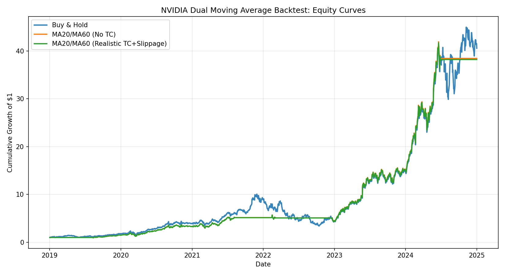
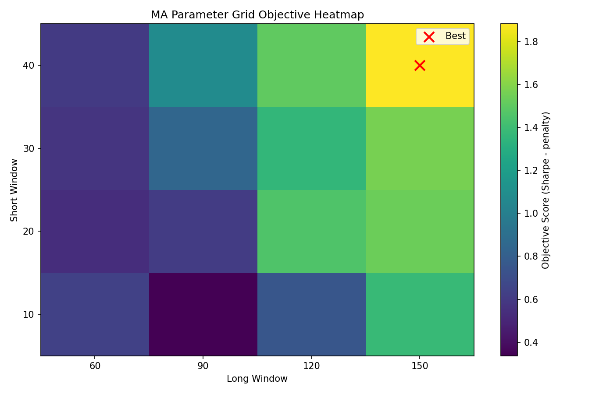
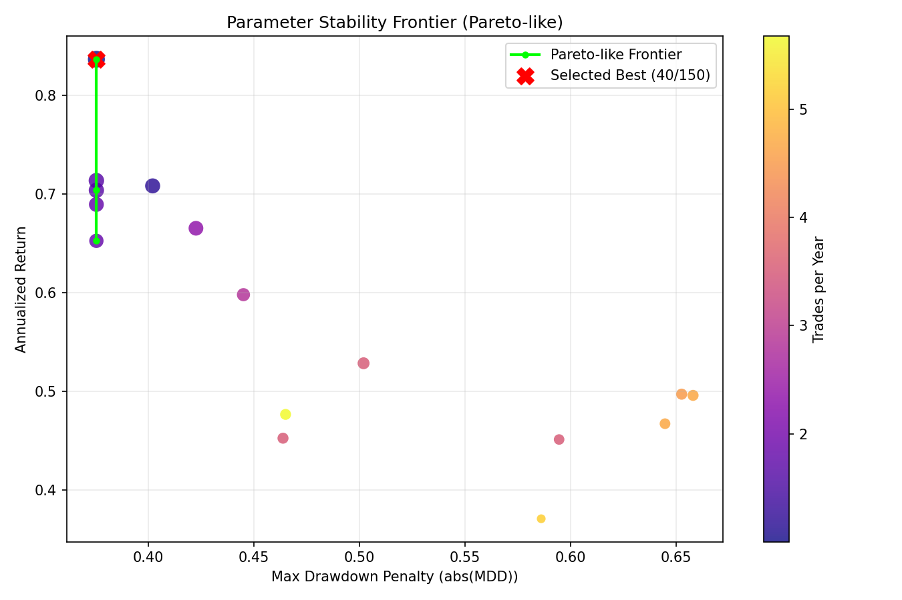
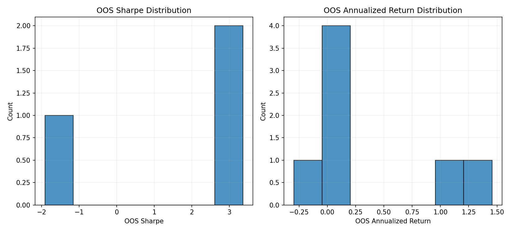

# NVIDIA MA20/MA60 回测

<div align="center">

**<PROJECT_TAGLINE>**  
一个面向量化研究学习与作品集展示的双均线回测项目（Dual Moving Average Backtest）。

[](#)
[](#license)
[](#)

</div>

## 项目简介（Project Description）
`<PROJECT_DESCRIPTION>`

本项目基于 CRSP 日频数据 `NVDA_CRSP.csv`，实现了一个清晰、可复现的双均线策略回测框架：
- 使用 `PRC` 计算 `MA20` 与 `MA60`
- 信号规则：`MA20 > MA60` 做多，否则空仓
- 使用信号滞后（Signal Lag）避免前视偏差（Look-Ahead Bias）
- 对比三类策略：买入持有、无成本双均线、含交易成本双均线
- 输出净值曲线图与绩效汇总表，便于研究复盘与展示

> 仓库地址（Repository URL）：`<REPO_URL>`  
> 在线演示（Deployment URL，可选）：`<DEPLOYMENT_URL>`

---

## 目录（Table of Contents）
- [项目亮点（Highlights）](#项目亮点highlights)
- [快速开始（Quick Start）](#快速开始quick-start)
- [策略介绍（Strategies）](#策略介绍strategies)
- [数据集说明（Dataset）](#数据集说明dataset)
- [结果与图像解析（Results \& Chart Interpretation）](#结果与图像解析results--chart-interpretation)
- [配置说明（Configuration）](#配置说明configuration)
- [项目结构（Project Structure）](#项目结构project-structure)
- [工程实践说明（Engineering Notes）](#工程实践说明engineering-notes)
- [常见问题（FAQ）](#常见问题faq)
- [路线图（Roadmap）](#路线图roadmap)
- [贡献指南（Contributing）](#贡献指南contributing)
- [许可证（License）](#许可证license)
- [作者信息（Author）](#作者信息author)

---

## 项目亮点（Highlights）
- ✅ 简洁可复现（Reproducible）：`requirements.txt + 一键运行`
- ✅ 回测规范（Backtest Hygiene）：时间排序、缺失处理、信号滞后
- ✅ 交易成本敏感性（Transaction Cost Sensitivity）：固定成本 + 滑点 + 冲击
- ✅ 参数网格搜索（Parameter Grid Search）：自动选择更优 MA 组合
- ✅ 滚动样本外验证（Walk-Forward OOS）：更贴近真实研究流程
- ✅ 风险收益并重（Risk-Adjusted Evaluation）：Sharpe、回撤、换手、交易次数
- ✅ 输出完整（Research Artifacts）：`performance_summary.csv` + `equity_curves.png`

---

## 快速开始（Quick Start）

### 1) 克隆仓库（Clone）
```bash
git clone <REPO_URL>
cd Quant_projects/Proj1_DualMovingAverage
```

### 2) 安装依赖（Install Dependencies）
```bash
python3 -m pip install -r requirements.txt
```

### 3) 运行回测（Run Backtest）
```bash
python3 backtest.py
```

### 4) 查看输出（Check Outputs）
```text
outputs/backtest_results.csv
outputs/performance_summary.csv
outputs/equity_curves.png
outputs/grid_search_summary.csv
outputs/walk_forward_results.csv
outputs/walk_forward_folds.csv
outputs/walk_forward_summary.csv
outputs/parameter_heatmap.png
outputs/parameter_pareto_like.png
outputs/oos_fold_distribution.png
```

---

## 策略介绍（Strategies）

| 策略名称 | 中文说明 | 核心逻辑 | 作用 |
|---|---|---|---|
| `Buy-and-Hold` | 买入并持有（基准） | 始终持仓（Position=1） | 作为基准（Benchmark）比较主动策略是否有增益 |
| `MA20/MA60 (No TC)` | 双均线无交易成本 | `MA20 > MA60` 做多，否则空仓；信号滞后 1 天执行 | 观察纯信号效果 |
| `MA20/MA60 (Realistic Cost)` | 双均线含真实成本 | 每次交易成本 = 固定 5bps + 半价差滑点 + 2bps 市场冲击 | 检验落地可交易性 |

---

## 数据集说明（Dataset）

### 数据概览
- 文件：`NVDA_CRSP.csv`
- 频率：日频（Daily）
- 标的：NVIDIA（`PERMNO 86580`）
- 时间范围：2019-01-02 至 2024-12-31

### 变量字典（Variable Dictionary）

| 字段 | 中文说明 | 英文术语 |
|---|---|---|
| `PERMNO` | CRSP 永久证券标识 | Permanent Security Identifier |
| `date` | 交易日期 | Trading Date |
| `COMNAM` | 公司名称 | Company Name |
| `PRC` | 日度价格（用于均线） | Daily Price |
| `VOL` | 成交量 | Trading Volume |
| `RET` | 总收益率（策略收益输入） | Total Return |
| `BID` | 买价 | Bid Quote |
| `ASK` | 卖价 | Ask Quote |
| `RETX` | 不含分红收益率 | Return Excluding Distributions |

---

## 结果与图像解析（Results & Chart Interpretation）

### 输出文件（Artifacts）
- `outputs/backtest_results.csv`：逐日回测明细（含信号、仓位、收益、净值）
- `outputs/performance_summary.csv`：策略绩效汇总
- `outputs/equity_curves.png`：三策略净值曲线对比图
- `outputs/grid_search_summary.csv`：参数网格搜索结果（含多目标评分）
- `outputs/walk_forward_results.csv`：滚动样本外逐日结果
- `outputs/walk_forward_folds.csv`：每个折（fold）的训练/测试区间与入选参数
- `outputs/walk_forward_summary.csv`：滚动样本外绩效汇总
- `outputs/parameter_heatmap.png`：参数网格目标热力图（含惩罚项）
- `outputs/parameter_pareto_like.png`：参数稳定性前沿图（Pareto-like）
- `outputs/oos_fold_distribution.png`：OOS 各 fold 指标分布图

### 图像预览（Screenshot）


### 读图建议（How to Read the Chart）
- 看终值（Terminal Wealth）：最终累计收益谁更高
- 看回撤（Drawdown）：大跌阶段谁回撤更深
- 看路径平滑度（Path Smoothness）：策略波动是否更稳定
- 看成本影响（Cost Impact）：无成本与含成本曲线之间的差距

### 关键指标（示例）
运行后，`performance_summary.csv` 将包含：
- 累计收益（Cumulative Return）
- 年化收益（Annualized Return）
- 年化波动（Annualized Volatility）
- 夏普比率（Sharpe Ratio）
- 最大回撤（Maximum Drawdown）
- 交易次数（Number of Trades）
- 日均换手（Average Daily Turnover）

### 结果解析（Result Interpretation）

#### 1) 三种策略的直观对比
- 买入持有（Buy-and-Hold）通常在单边强趋势中表现更强，但路径波动更大。
- 双均线无成本（MA20/MA60 No TC）更强调趋势过滤，常见特征是收益与回撤同时下降。
- 双均线含成本（MA20/MA60 With TC）在无成本策略基础上进一步下修，反映实际交易摩擦（Execution Friction）。

#### 2) 交易成本影响怎么读
- 若 `No TC` 与 `With TC` 两条曲线差距很小，说明策略换手（Turnover）可控、成本压力有限。
- 若两条曲线显著拉开，说明策略可能过度交易（Overtrading），需要优化信号稳定性或成本模型。

#### 3) 风险收益权衡怎么解释
- 若策略年化收益低于基准，但最大回撤更小、波动更低，代表策略提供了风险控制价值（Risk Control Value）。
- 若策略夏普（Sharpe Ratio）高于基准，代表单位风险回报更优（Better Risk-Adjusted Return）。
- 评估时建议同时看“收益、波动、回撤、交易次数”，避免单指标结论。

#### 4) 可直接复述的结论模板（面试友好）
- “在当前样本期内，买入持有收益更高，但双均线策略在回撤与波动上更可控，体现了趋势过滤对风险暴露管理的价值。”
- “加入固定成本、半价差滑点与市场冲击后，策略净值有可见下修，说明执行假设会实质影响策略可落地性评估。”
- “该原型适合作为研究起点，后续应通过样本外检验、参数稳健性与更真实滑点模型做进一步验证。”

---

## 配置说明（Configuration）
当前项目无复杂配置，默认参数已写在 `backtest.py` 中：

```python
short_grid = [10, 20, 30, 40]
long_grid = [60, 90, 120, 150]
fixed_cost_one_way = 0.0005
market_impact_one_way = 0.0002
trade_penalty_lambda = 0.05
drawdown_penalty_lambda = 0.6
train_window = 504
test_window = 126
```

如需扩展环境变量或外部配置，可使用占位符：

```text
API_KEY=<API_KEY>
DATABASE_URL=<DATABASE_URL>
```

---

## 项目结构（Project Structure）

```text
Proj1_DualMovingAverage/
├── NVDA_CRSP.csv
├── backtest.py
├── requirements.txt
├── README.md
└── outputs/
    ├── backtest_results.csv
    ├── performance_summary.csv
    ├── equity_curves.png
    ├── grid_search_summary.csv
    ├── walk_forward_results.csv
    ├── walk_forward_folds.csv
    ├── walk_forward_summary.csv
    ├── parameter_heatmap.png
    ├── parameter_pareto_like.png
    └── oos_fold_distribution.png
```

---

## 工程实践说明（Engineering Notes）
- 数据处理：日期解析（Datetime Parsing）+ 时间排序（Chronological Sorting）
- 回测规范：信号滞后避免前视偏差（Look-Ahead Bias）
- 成本模型：固定成本 + 半价差滑点 + 市场冲击（Fixed + Half-Spread Slippage + Impact）
- 参数优化：网格搜索（Grid Search）按“多目标评分函数”选参，抑制过拟合  
  `Objective = Sharpe - λ1*trades_per_year - λ2*max_drawdown_penalty`
- 验证方式：滚动样本外（Walk-Forward OOS）避免只看样本内拟合
- 可复现性：固定脚本入口 + 标准依赖文件

> 严谨 CRSP 研究通常会使用复权因子（如 `CFACPR`）做公司行为调整。  
> 当前数据未包含该字段，本项目使用 `PRC` 作为原型输入。

---

## 常见问题（FAQ）

### Q1: 为什么策略收益低于买入持有？
A: 样本期内 NVDA 趋势较强，趋势过滤可能会错过部分快速上涨区间；策略重点是控制风险并验证可执行性，不保证在每个样本期跑赢基准。

### Q2: 为什么要加入交易成本？
A: 无成本结果通常高估真实表现。加入成本后更接近实盘执行条件。

### Q3: 这个项目适合生产环境吗？
A: 当前更偏研究原型（Prototype）。生产化还需补充：样本外验证、参数稳健性、滑点模型、风险约束与监控。

---

## 路线图（Roadmap）
- [x] 增加参数网格搜索（MA 参数敏感性）
- [x] 增加样本外 / 滚动窗口验证（Walk-Forward）
- [ ] 增加多资产测试（Multi-Asset）
- [x] 增加更真实交易成本与滑点模型
- [ ] 增加自动化测试与 CI

---

## 贡献指南（Contributing）
欢迎提交 Issue 和 Pull Request。

1. Fork 本仓库
2. 新建功能分支
3. 提交变更并附带说明
4. 发起 PR，描述动机、方案与验证结果

---

## 许可证（License）
本项目采用 `<LICENSE_TYPE>` 许可证。  
如仓库尚未添加许可证文件，请在根目录补充 `LICENSE`。

---

## 作者信息（Author）
- 作者：`<AUTHOR_NAME>`
- 邮箱：`<AUTHOR_EMAIL>`
- GitHub：`<GITHUB_PROFILE>`


---

<!-- AUTO_RESULTS_START -->
### 自动更新结果（Auto Updated Results）
- 更新时间：`2026-04-25 14:21:45`
- 全样本网格搜索最优参数（按惩罚后目标）：`short=40`, `long=150`
- 目标函数（Objective）：`Sharpe - λ1*trades_per_year - λ2*max_drawdown_penalty`
- 其中：`λ1=0.05`, `λ2=0.6`

#### 主回测绩效（Main Backtest Summary）

| metric | buy_and_hold | ma_20_60_no_tc | ma_20_60_realistic_cost |
|---|---|---|---|
| cumulative_return | 39.5633 | 37.4411 | 37.2108 |
| annualized_return | 0.8551 | 0.8386 | 0.8367 |
| annualized_volatility | 0.5187 | 0.3879 | 0.3879 |
| sharpe_ratio | 1.6485 | 2.1621 | 2.1572 |
| max_drawdown | -0.6634 | -0.3755 | -0.3755 |
| number_of_trades | 1.0 | 6.0 | 6.0 |
| avg_daily_turnover | 0.0007 | 0.004 | 0.004 |

#### 滚动样本外绩效（Walk-Forward OOS Summary）

| metric | wf_buy_and_hold | wf_ma_tc |
|---|---|---|
| cumulative_return | 8.5944 | 0.8799 |
| annualized_return | 0.908 | 0.1976 |
| annualized_volatility | 0.5286 | 0.2294 |
| sharpe_ratio | 1.7176 | 0.8613 |
| max_drawdown | -0.6634 | -0.2775 |
| number_of_trades | 1.0 | 6.0 |
| avg_daily_turnover | 0.0011 | 0.0068 |

#### 稳健性图表（Robustness Plots）






#### 自动结论（Auto Conclusion）
- 滚动样本外中，MA 策略风险调整后未跑赢基准，需进一步优化。
<!-- AUTO_RESULTS_END -->
