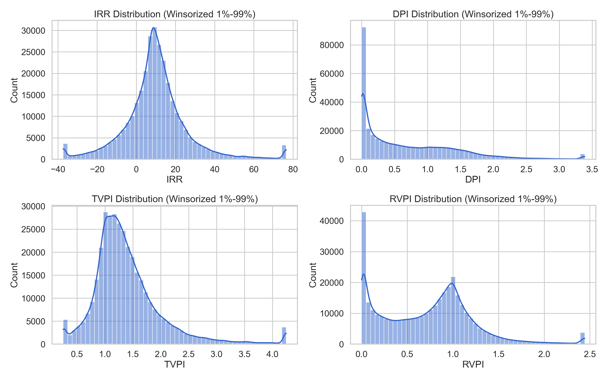
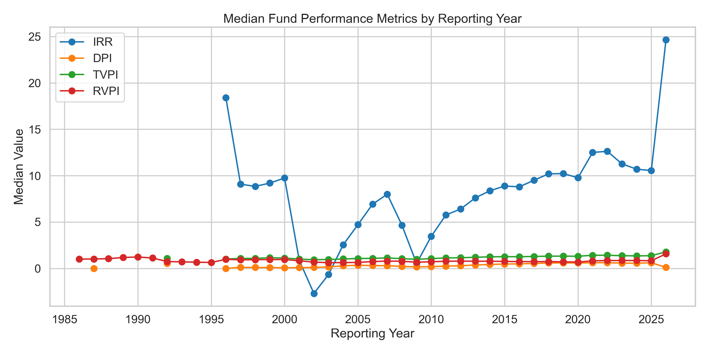
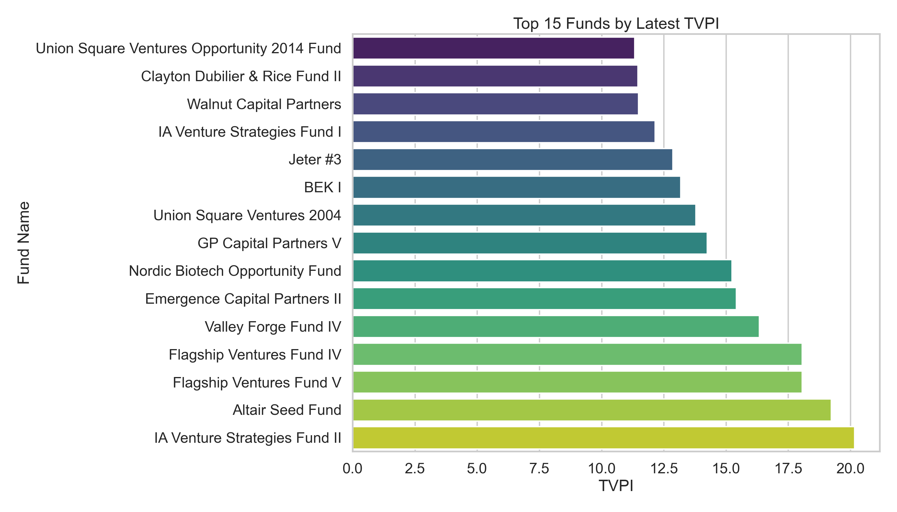

# Fund Performance Analysis

## 项目目标
本项目针对 `Fund_performance_20260426.csv` 进行专业化基金绩效分析，重点解决原始数据中大规模缺失值问题，并输出可复现的数据清洗结果、探索性分析和可视化结论。

## 数据说明
- 原始文件：`Fund_performance_20260426.csv`
- 字段：`fundid`、`fundname`、`asofyear`、`asofquarter`、`irr`、`dpi`、`tvpi`、`rvpi`
- 原始规模：670,787 行，162,671 支基金

## 数据清洗流程
为确保分析结论可解释、可比、可复用，清洗流程如下：

1. 基础标准化
   - 去除基金名空白字符，剔除缺失基金名记录。
   - 将 `irr`、`dpi`、`tvpi`、`rvpi` 强制转换为数值类型（无法转换的值记为缺失）。
   - 将 `asofyear`、`asofquarter` 转换为数值，并基于有效年份+季度生成 `report_date`。
2. 去重与缺失处理
   - 删除完全重复记录。
   - 删除四项绩效指标均缺失的记录（无分析价值）。
3. 基金数据充足性筛选（关键）
   - 统计每支基金拥有“至少一项绩效指标不缺失”的有效观测期数。
   - 仅保留有效观测期数 `>= 4` 的基金，剔除样本过短基金。

### 清洗结果
- 清洗后记录数：379,636（保留 56.6%）
- 清洗后基金数：13,989（保留 8.6%）
- 被剔除记录：291,151
- 被剔除基金：148,682

说明：基金保留比例较低，反映原始数据中大量基金仅有极少量或无有效绩效数据。该筛选显著提升了后续统计稳定性。

## 分析方法（EDA）
分析脚本：`analyze_fund_performance.py`

1. 描述统计
   - 对 `irr`、`dpi`、`tvpi`、`rvpi` 输出计数、均值、分位数、极值统计。
2. 年度中位数趋势
   - 按 `asofyear` 聚合并计算四项指标的年度中位数，观察市场周期变化。
3. 头部基金识别
   - 基于每支基金最新一期观测值，按 `tvpi` 排序，提取 Top 15。
4. 可视化处理策略
   - 分布图对各指标做 1%-99% winsorize 后展示，降低极端值对图形可读性的影响（原始数值仍保留在清洗后数据中）。

## 关键发现
1. 样本质量改善明显  
   清洗后保留了超过一半记录，但仅约 8.6% 基金满足最小时间序列长度要求，说明原始库存在显著长尾空数据问题。

2. 指标分布存在长尾  
   `dpi`、`tvpi`、`rvpi` 的最大值远高于中位数，表明存在少量极端高回报样本；分析与可视化需同时关注稳健统计（中位数、分位数）。

3. 年度中位数呈周期特征  
   从年度中位数序列表看，`irr` 在 2000 年代初有明显回落，随后逐步恢复，符合基金业绩的周期性特征。

4. 头部基金集中度高  
   最新观测 `tvpi` Top 15 基金表现显著优于总体中位数，呈现明显的头部集中现象。

## 可视化结果
脚本自动输出图表到 `output/figures/`：

- `distribution_metrics.png`：四项绩效指标分布（1%-99% winsorize）
- `median_metrics_by_year.png`：按报告年份的绩效中位数趋势
- `top15_latest_tvpi.png`：最新一期 TVPI 最高的 15 支基金

### 1) 四项绩效指标分布


### 2) 年度中位数趋势


### 3) 最新一期 TVPI Top 15


## 输出文件
运行脚本后会在 `output/` 目录生成：

- `fund_performance_cleaned.csv`：清洗后明细数据
- `metric_stats.csv`：指标描述统计
- `median_metrics_by_year.csv`：年度中位数时间序列
- `top15_latest_tvpi.csv`：最新一期 TVPI Top 15 基金
- `summary.json`：清洗前后规模摘要

## 复现步骤
在 `VCAnalysis/Fund_performance` 目录执行：

```bash
python3 -m pip install pandas matplotlib seaborn
python3 analyze_fund_performance.py
```

运行完成后，查看 `output/` 与 `output/figures/` 即可获取全部结果。

## 方法边界与后续优化建议
- 当前未按基金策略、地区、币种进行分层，后续可做分组对比分析。
- 可加入异常值稳健性检验（如 IQR 过滤与 winsorize 对比）。
- 可新增滚动窗口趋势图、分位数带状图与基金分层回报热力图，进一步增强决策价值。
