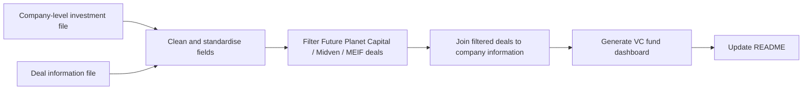

# Data Cleaning Memo

This memo documents the procedure used by `generate_dashboard.py` to create the investor-facing dashboard and cleaned datasets.

## Inputs
- `MEIF West Midlands Equity Fund_investment.csv`: company-level investment and portfolio attributes.
- `Deal_Info_20260426.csv`: deal-level records used to identify fund-relevant investments.

## Investor / Fund Filter
Deals are retained when investor, fund, participant, or deal synopsis text contains one of the following case-insensitive patterns:
- `future planet capital`
- `midven`
- `midlands engine investment fund`
- `midlands engine`
- `meif`

Matched columns used in this run: dealsynopsis, investors, newinvestors, followoninvestors.

## Procedure

## Data Cleaning & Filtering Workflow

### Step 1: Load and standardise data
- Load the company-level investment file and deal information file.
- Standardise column names, company names, investor names, dates, and currency / deal-size fields.
- Output impact: both raw files become comparable, searchable, and ready for reliable grouping and joins.

### Step 2: Filter relevant fund deals
- Use the deal information file to identify deals involving Future Planet Capital, Midven, Midlands Engine Investment Fund, MEIF, or related naming variations.
- Apply case-insensitive matching and remove irrelevant deals from other investors or funds.
- Output impact: the dashboard excludes the broader multi-fund company universe and reflects only fund-relevant activity.

### Step 3: Join filtered deals to company information
- Join filtered deals back to the company-level data using the best available key: company ID first, then deal ID or cleaned company name where available.
- Keep only companies and investments linked to the filtered relevant deals.
- Output impact: all dashboard metrics are generated from the final filtered dataset only.

## Generated Outputs

| File | Rows | Description |
|---|---|---|
| `cleaned_company_investments.csv` | 8 | Standardised company-level dataset |
| `cleaned_deal_info.csv` | 41 | Standardised full deal-level dataset |
| `filtered_relevant_deals.csv` | 12 | Filtered fund-relevant deals |
| `final_dashboard_dataset.csv` | 12 | Final joined dataset used for README metrics |

## Key Safeguards
- Metrics requiring unavailable columns are skipped rather than inferred.
- Missing deal sizes are excluded from capital-based metrics and reported as data-quality limitations.
- The final dashboard is based only on filtered deal records, not the full company-level file.
