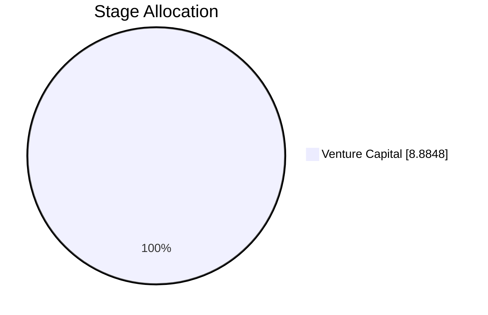
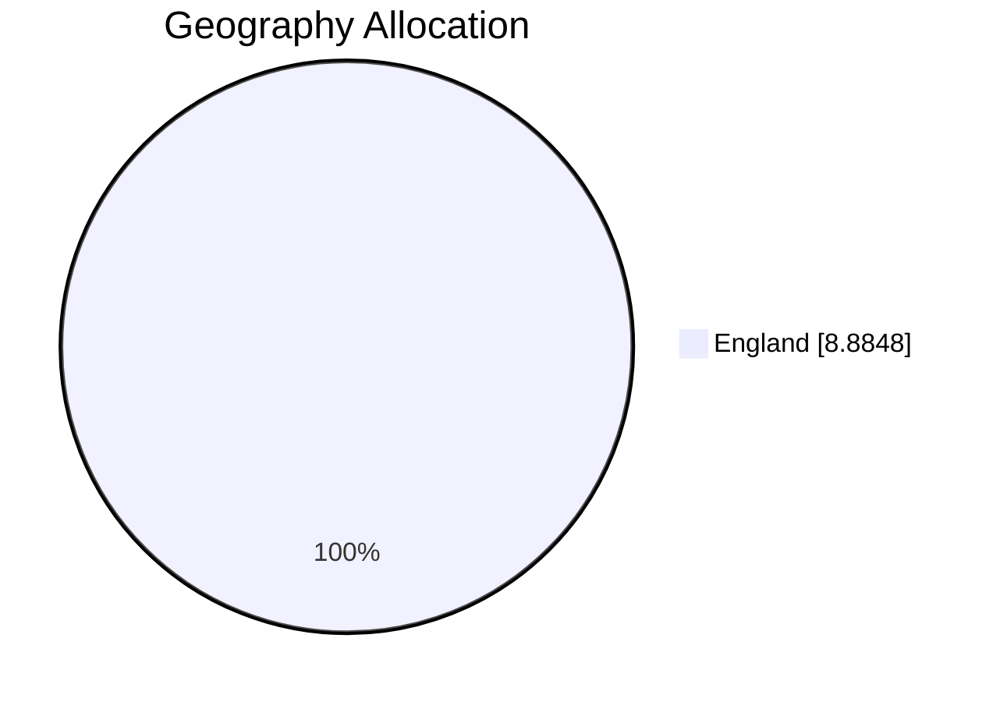
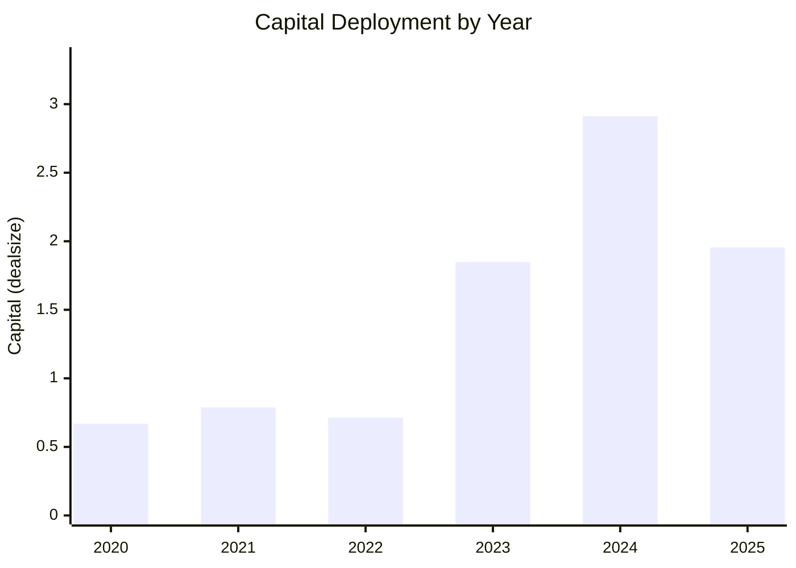
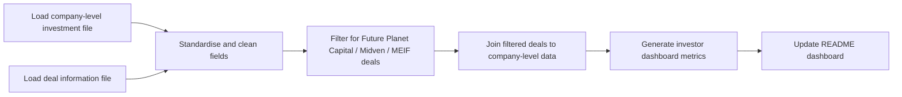

# MEIF Relevant Deals Dashboard

> Sources: `MEIF West Midlands Equity Fund_investment.csv` + `Deal_Info_20260426.csv` | Filtered by investor names: Future Planet Capital / Midven / Midlands Engine Investment Fund (+ MEIF variations)

> Relevant filtered deals: **12** (matched using columns: dealsynopsis, investors, newinvestors, followoninvestors)

## Cleaned Data Outputs

This dashboard also generates cleaned CSV files so the analysis can be reviewed or reused:

- `cleaned_company_investments.csv`: standardized company-level investment file.
- `cleaned_deal_info.csv`: standardized full deal-level file before filtering.
- `filtered_relevant_deals.csv`: only deals linked to Future Planet Capital, Midven, Midlands Engine Investment Fund, or MEIF-related naming.
- `final_dashboard_dataset.csv`: final joined dataset used to calculate every dashboard metric below.

## Table of Contents

- [Cleaned Data Outputs](#cleaned-data-outputs)
- [1) Executive Fund Snapshot](#1-executive-fund-snapshot)
- [2) Capital Allocation Breakdown](#2-capital-allocation-breakdown)
- [3) Concentration and Risk Checks](#3-concentration-and-risk-checks)
- [4) Practical Management Insights](#4-practical-management-insights)
- [5) Data Quality and Coverage](#5-data-quality-and-coverage)
- [Rebuild](#rebuild)
- [Data Cleaning & Filtering Workflow (Audit Trail)](#data-cleaning--filtering-workflow-audit-trail)

## 1) Executive Fund Snapshot

| Metric | Value |
|---|---|
| Total relevant deals | 12 |
| Total invested capital | 8.88 |
| Number of portfolio companies | 8 |
| Average deal size | 0.99 |
| Median deal size | 0.71 |
| Largest investment | IDenteq (1.95) |
| Most recent investment | CyberQ Group (2026-03-01) |

Focus: only deal activity tied to target investors/funds for day-to-day monitoring.

## 2) Capital Allocation Breakdown

### Top Companies by Invested Amount
| Company | Capital | Share of Total |
|---|---|---|
| iEthico | 2.36 | 26.6% |
| IDenteq | 1.95 | 22.0% |
| Medmin | 1.85 | 20.8% |
| CyberQ Group | 1.26 | 14.2% |
| Birtelli's | 0.68 | 7.7% |

### Allocation by Sector
| Sector | # Investments | Capital | Share |
|---|---|---|---|
| Healthcare | 3 | 4.21 | 47.4% |
| Information Technology | 3 | 3.69 | 41.5% |
| Consumer Products and Services (B2C) | 1 | 0.68 | 7.7% |
| Energy | 2 | 0.30 | 3.4% |

Shows where exposure is concentrated by industry theme.

### Allocation by Stage
| Stage | # Investments | Capital | Share |
|---|---|---|---|
| Venture Capital | 9 | 8.88 | 100.0% |

Checks whether deployment stays aligned with stage mandate.

### Allocation by Geography
| Region | # Investments | Capital | Share |
|---|---|---|---|
| England | 9 | 8.88 | 100.0% |

Highlights location concentration and sourcing breadth.

### Allocation by Year
| Year | # Deals | Capital |
|---|---|---|
| 2020 | 2 | 0.67 |
| 2021 | 2 | 0.79 |
| 2022 | 1 | 0.71 |
| 2023 | 1 | 1.85 |
| 2024 | 2 | 2.91 |
| 2025 | 1 | 1.95 |

Tracks deployment pace and vintage clustering.

### Top Co-Investors (in filtered deals)
| Co-investor | # Deals |
|---|---|
| Uk Innovation & Science Seed Fund | 3 |

## 3) Concentration and Risk Checks

| Check | Result |
|---|---|
| Top 5 companies as % of total capital | 91.3% |
| Largest sector exposure | Healthcare (47.4%) |
| Largest geography exposure | England (100.0%) |
| Unusually large deals (IQR rule) | None flagged / insufficient data |

## 4) Practical Management Insights

- Capital concentration is high: top 5 companies represent **91.3%** of tracked capital.
- Geographic exposure is concentrated in **England** (100.0%).
- Some filtered deals have missing deal size; this reduces capital-based comparability.
- Deployment is concentrated by vintage; peak year is **2024**.

### Suggested Daily Follow-Ups
- Compare every new deal against median ticket size before IC sign-off.
- Maintain watchlist of top holdings and expected follow-on capital needs.
- Update missing data fields weekly to keep dashboard decision-ready.

## 5) Data Quality and Coverage

| Field | Missing | Status |
|---|---|---|
| Deal size | 3/12 (25.0%) | Partial |
| Deal date | 0/12 (0.0%) | OK |
| Sector | 0/12 (0.0%) | OK |
| Stage | 0/12 (0.0%) | OK |
| Geography | 0/12 (0.0%) | OK |
| Deal ID | 0/12 (0.0%) | OK |

## 6) Generated Cleaned Datasets

| Output file | Rows | Purpose |
|---|---|---|
| `cleaned_company_investments.csv` | 8 | Standardized company-level investment dataset |
| `cleaned_deal_info.csv` | 41 | Standardized deal-level dataset before filtering |
| `filtered_relevant_deals.csv` | 12 | Relevant MEIF / Midven / Future Planet Capital deals after filtering |
| `final_dashboard_dataset.csv` | 12 | Final joined analytics dataset used for dashboard metrics |

## Rebuild

Run `python generate_dashboard.py` for full dashboard, or `python generate_dashboard.py --brief` for one-page mode.

## Data Cleaning & Filtering Workflow (Audit Trail)

### Step 1: Load and standardise both datasets
| Step 1 Item | Details |
|---|---|
| Input | `MEIF West Midlands Equity Fund_investment.csv` and `Deal_Info_20260426.csv` raw CSV exports |
| Processing | Standardize headers to lowercase `snake_case`; trim text; normalize key text fields (company, investor/fund, sector, stage, geography); parse date and deal-size fields with safe coercion |
| Output | Schema-consistent company-level and deal-level dataframes ready for filtering and join |
| Impact on metrics | Prevents casing/spacing mismatches and reduces parsing errors in date, amount, and grouping calculations |

### Step 2: Identify relevant MEIF-related deals
| Step 2 Item | Details |
|---|---|
| Input | Standardized deal-level dataframe |
| Processing | Case-insensitive keyword matching across investor/fund-related text fields for `Future Planet Capital`, `Midven`, `Midlands Engine Investment Fund`, plus `MEIF` / `Midlands Engine` variations; drop non-matching rows; deduplicate repeated deal records where applicable |
| Output | Filtered relevant-deals dataframe containing only target-fund-linked transactions |
| Impact on metrics | Ensures all dashboard KPIs exclude unrelated investors/funds and reflect MEIF-relevant activity only |

### Step 3: Join filtered deals to company-level information
| Step 3 Item | Details |
|---|---|
| Input | Filtered relevant-deals dataframe + standardized company-level dataframe |
| Processing | Join keys applied in priority order: `companyid` (preferred), then fallback to cleaned company-name matching when IDs are unavailable |
| Output | Final analytics dataset used for all summary metrics, breakdowns, concentration checks, and insights |
| Impact on metrics | Links deal activity to sector/stage/geography/company attributes and prevents leakage from unfiltered company universe |

