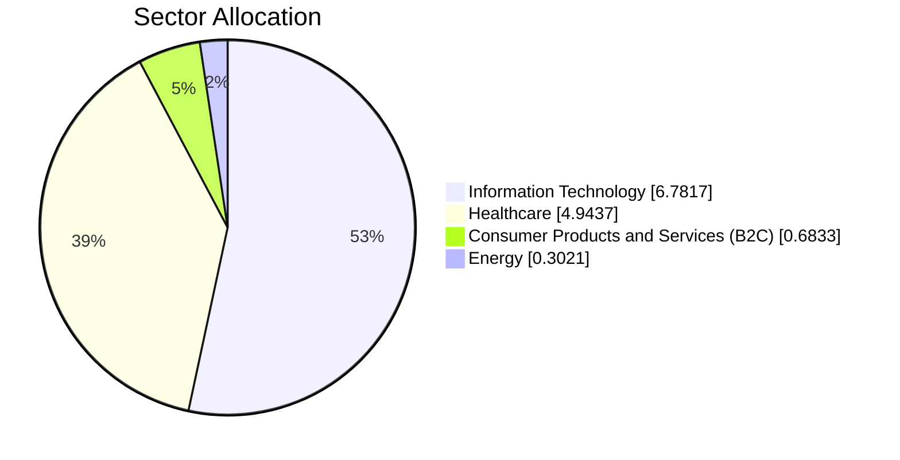
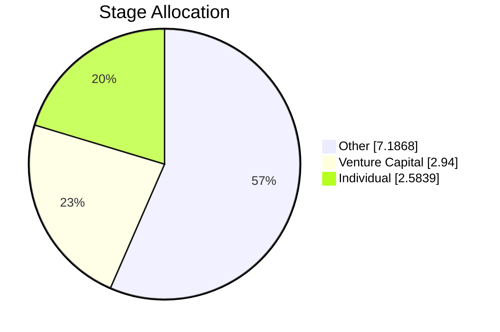
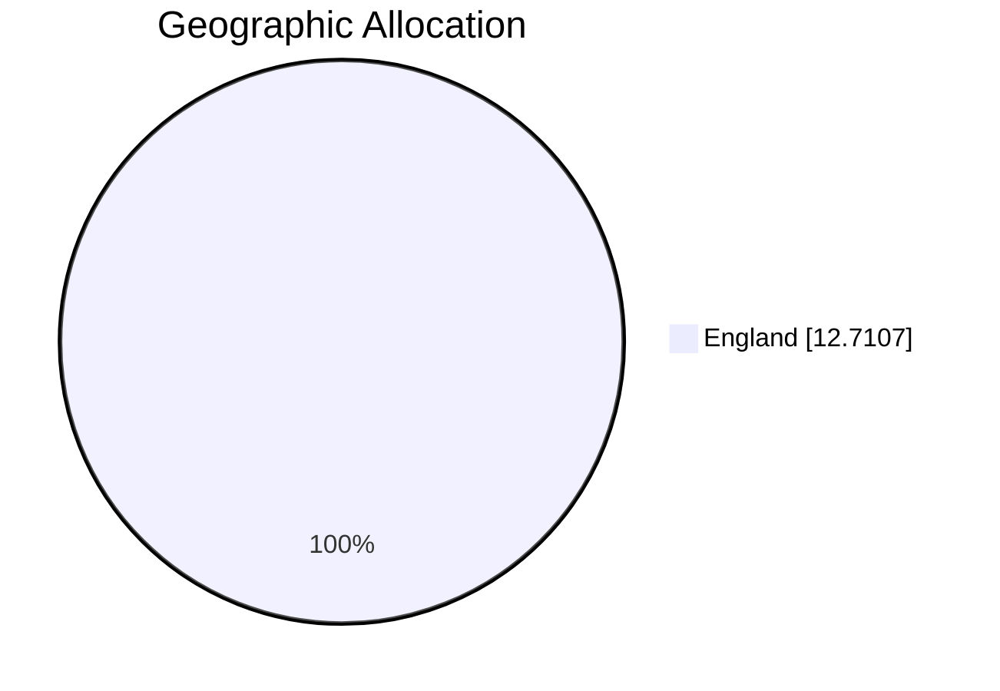
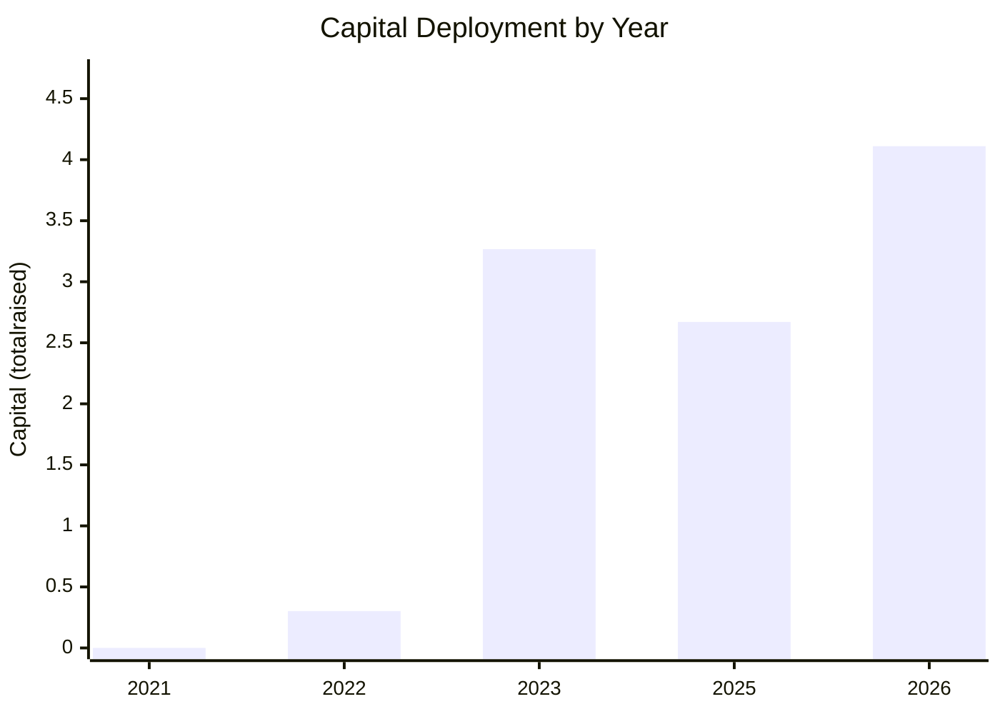

# MEIF West Midlands Equity Fund - Investor Dashboard

> Data source: `MEIF West Midlands Equity Fund_investment.csv`
> Dataset rows: **8** investments | Amount coverage: **7/8 (87.5%)** using `totalraised`

This dashboard is designed for lead-investor portfolio monitoring: capital deployment, concentration risk, diversification balance, and follow-up actions.

## 1) Fund Overview

| Metric | Value |
|---|---|
| Total investments | 8 |
| Total capital invested (`totalraised`) | 12.71 |
| Average investment size | 1.82 |
| Median investment size | 1.95 |
| Largest investment | CyberQ Group (4.11) |
| Smallest investment | Utility Stream (0.30) |
| Unique companies | 8 |
| Unique sectors | 4 |
| Unique stages | 3 |
| Unique locations (cities) | 5 |

Quick read: the portfolio is compact and fairly concentrated; one record has missing amount and is excluded from capital metrics.

## 2) Portfolio Breakdown

### By Sector
| Sector | # Investments | Capital | Capital Share |
|---|---|---|---|
| Information Technology | 4 | 6.78 | 53.4% |
| Healthcare | 2 | 4.94 | 38.9% |
| Consumer Products and Services (B2C) | 1 | 0.68 | 5.4% |
| Energy | 1 | 0.30 | 2.4% |

Sector allocation indicates where incremental capital may reduce single-theme exposure.

### By Stage (Deal Class)
| Stage | # Investments | Capital | Capital Share |
|---|---|---|---|
| Other | 4 | 7.19 | 56.5% |
| Venture Capital | 3 | 2.94 | 23.1% |
| Individual | 1 | 2.58 | 20.3% |

Stage mix helps check whether deployment pace aligns with the intended risk-return profile.

### By Geography (State/Province)
| Region | # Investments | Capital | Capital Share |
|---|---|---|---|
| England | 8 | 12.71 | 100.0% |

Geographic concentration is currently high and should be tracked against pipeline diversity targets.

### By Investment Year
| Year | # Investments | Capital |
|---|---|---|
| 2021 | 1 | 0.00 |
| 2022 | 1 | 0.30 |
| 2023 | 2 | 3.27 |
| 2025 | 2 | 2.67 |
| 2026 | 1 | 4.11 |

Yearly deployment view highlights timing clusters and helps with vintage balancing decisions.

### Top Funded Companies
| Company | Capital | Share of Total |
|---|---|---|
| CyberQ Group | 4.11 | 32.3% |
| Medmin | 2.58 | 20.3% |
| iEthico | 2.36 | 18.6% |
| IDenteq | 1.95 | 15.4% |
| D-RisQ | 0.72 | 5.6% |
| Birtelli's | 0.68 | 5.4% |
| Utility Stream | 0.30 | 2.4% |

## 3) Risk and Concentration Analysis

| Concentration Indicator | Value |
|---|---|
| Largest single investment share | 32.3% |
| Top 3 investments share | 71.2% |
| Top 5 investments share | 92.2% |
| Largest sector share | 53.4% (Information Technology) |
| Largest geography share | 100.0% (England) |

- **High name concentration:** top 5 positions account for **92.2%** of deployed capital.
- **Sector concentration risk:** `Information Technology` represents **53.4%** of capital.
- **Geographic concentration risk:** `England` represents **100.0%** of capital.

## 4) Performance and Management Insights

- Capital is currently tilted toward **Information Technology**; consider setting a target max sector weight before the next allocation cycle.
- Underrepresented sectors by capital (below median sector allocation): **Consumer Products and Services (B2C), Energy**.
- Deployment is lumpy by vintage; **2026** is the peak capital year. Smoothing vintages may reduce timing risk.
- One investment has missing amount data; standardize deal-size capture to improve allocation and risk reporting quality.
- For pipeline triage, benchmark each new deal against current median ticket size to prevent unintentional ticket drift.

### Suggested Portfolio Review Questions
- Should we cap single-company exposure at a defined threshold (e.g., 20-25% of deployed capital)?
- Do we want a target sector mix to avoid excessive concentration in one theme?
- Which regions within the West Midlands pipeline are under-sourced today?
- Are follow-on reserves aligned with the existing concentration profile?
- Which deals have strategic value beyond ticket size (ecosystem, signaling, syndicate quality)?

## 5) Data Notes and Method
- Column names were standardized to lowercase snake_case during analysis to avoid formatting issues.
- Capital metrics use `totalraised` as the cross-company amount proxy; values are used as provided in source data.
- Missing values are excluded from numeric aggregations and explicitly flagged where relevant.
- Date-based charts use `lastfinancingdate` (fallback to first financing date if last financing date is unavailable).
