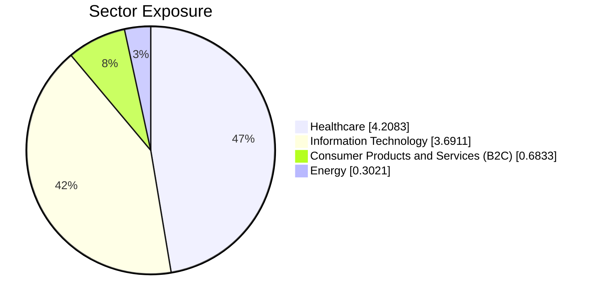
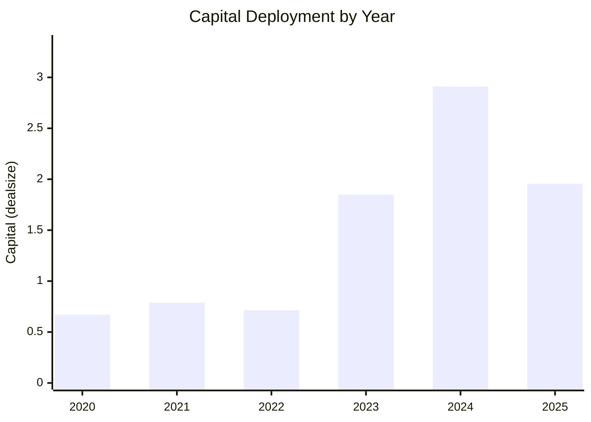
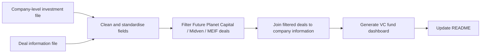

# MEIF Fund-Relevant VC Dashboard

This dashboard focuses only on deals related to **Future Planet Capital**, **Midven**, and **Midlands Engine Investment Fund / MEIF**.
The original company-level file includes investments linked to multiple funds, so `Deal_Info_20260426.csv` is used to filter fund-relevant transactions before any metrics are calculated.
All exposure, concentration, deployment, and data-quality views below are based on `final_dashboard_dataset.csv`.

## Table of Contents

- [Executive Snapshot](#executive-snapshot)
- [Fund Exposure](#fund-exposure)
- [Concentration Risk](#concentration-risk)
- [Deployment Pace](#deployment-pace)
- [Portfolio Health & Data Quality](#portfolio-health--data-quality)
- [Generated Files](#generated-files)
- [Data Cleaning & Filtering Workflow](#data-cleaning--filtering-workflow)

## Executive Snapshot

| Metric | Value |
|---|---|
| Relevant deals | 12 |
| Portfolio companies | 8 |
| Total tracked capital | 8.88 |
| Average deal size | 0.99 |
| Median deal size | 0.71 |
| Largest deal | IDenteq (1.95) |
| Most recent deal | CyberQ Group (2026-03-01) |

## Fund Exposure

### Top Portfolio Companies
| Company | Tracked Capital | Share of Total |
|---|---|---|
| iEthico | 2.36 | 26.6% |
| IDenteq | 1.95 | 22.0% |
| Medmin | 1.85 | 20.8% |
| CyberQ Group | 1.26 | 14.2% |
| Birtelli's | 0.68 | 7.7% |

### Sector Exposure
| Sector | # Deals | Capital | Share |
|---|---|---|---|
| Healthcare | 3 | 4.21 | 47.4% |
| Information Technology | 3 | 3.69 | 41.5% |
| Consumer Products and Services (B2C) | 1 | 0.68 | 7.7% |
| Energy | 2 | 0.30 | 3.4% |

### Stage Exposure
| Stage | # Deals | Capital | Share |
|---|---|---|---|
| Venture Capital | 9 | 8.88 | 100.0% |

### Geography Exposure
| Region | # Deals | Capital | Share |
|---|---|---|---|
| England | 9 | 8.88 | 100.0% |

## Concentration Risk

| Risk Check | Result | Management Read |
|---|---|---|
| Top 5 company concentration | 91.3% | High if this remains above 75% |
| Largest sector exposure | Healthcare (47.4%) | Monitor sector caps and pipeline balance |
| Largest geography exposure | England (100.0%) | Check sourcing breadth within mandate |
| Unusually large deals | None flagged / insufficient data | Review any outliers before follow-on decisions |

## Deployment Pace

| Year | # Deals | Capital |
|---|---|---|
| 2020 | 2 | 0.67 |
| 2021 | 2 | 0.79 |
| 2022 | 1 | 0.71 |
| 2023 | 1 | 1.85 |
| 2024 | 2 | 2.91 |
| 2025 | 1 | 1.95 |

Peak tracked deployment year: **2024**.

## Portfolio Health & Data Quality

- Capital is concentrated: top 5 companies represent **91.3%** of tracked capital.
- Sector exposure is led by **Healthcare** at **47.4%**.
- Geography exposure is led by **England** at **100.0%**.
- Missing deal sizes limit full capital-weighted assessment; treat capital totals as tracked disclosed capital.

| Data Field | Missing | Status |
|---|---|---|
| Deal size | 3/12 (25.0%) | Partial |
| Deal date | 0/12 (0.0%) | OK |
| Sector | 0/12 (0.0%) | OK |
| Stage | 0/12 (0.0%) | OK |
| Geography | 0/12 (0.0%) | OK |
| Deal ID | 0/12 (0.0%) | OK |

### Visible Co-Investors
| Co-investor | # Deals |
|---|---|
| Uk Innovation & Science Seed Fund | 3 |

## Generated Files

| File | Rows | What it is |
|---|---|---|
| `cleaned_company_investments.csv` | 8 | Cleaned company-level investment data |
| `cleaned_deal_info.csv` | 41 | Cleaned deal-level data before filtering |
| `filtered_relevant_deals.csv` | 12 | Filtered fund-relevant deal records |
| `final_dashboard_dataset.csv` | 12 | Final analytics dataset used by this dashboard |
| `DATA_CLEANING_MEMO.md` | 1 memo | Detailed data-cleaning and filtering documentation |

Run `python generate_dashboard.py` to regenerate the README, cleaned datasets, and cleaning memo.

## Data Cleaning & Filtering Workflow

### Step 1: Load and standardise data
- Load the company-level investment file and deal information file.
- Standardise column names, company names, investor names, dates, and currency / deal-size fields.
- Output impact: both raw files become comparable, searchable, and ready for reliable grouping and joins.

### Step 2: Filter relevant fund deals
- Use the deal information file to identify deals involving Future Planet Capital, Midven, Midlands Engine Investment Fund, MEIF, or related naming variations.
- Apply case-insensitive matching and remove irrelevant deals from other investors or funds.
- Output impact: the dashboard excludes the broader multi-fund company universe and reflects only fund-relevant activity.

### Step 3: Join filtered deals to company information
- Join filtered deals back to the company-level data using the best available key: company ID first, then deal ID or cleaned company name where available.
- Keep only companies and investments linked to the filtered relevant deals.
- Output impact: all dashboard metrics are generated from the final filtered dataset only.

