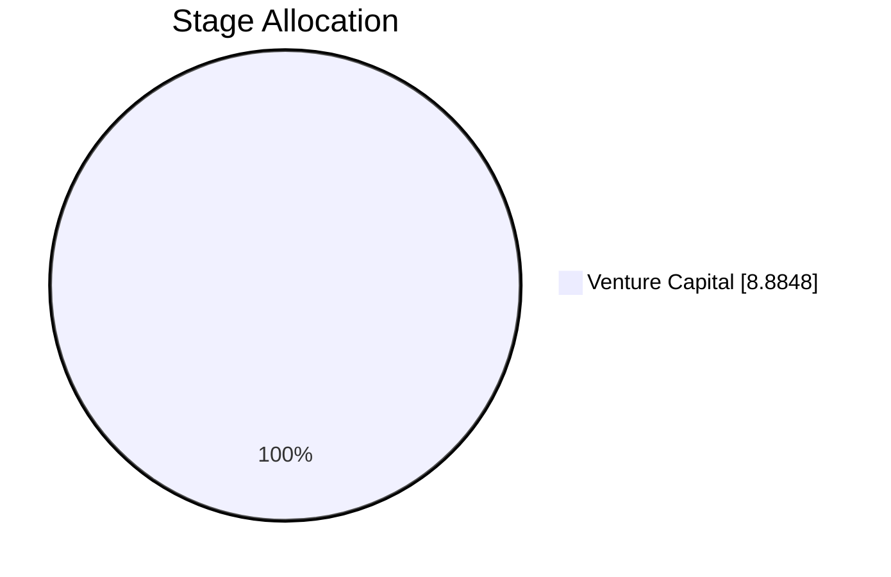
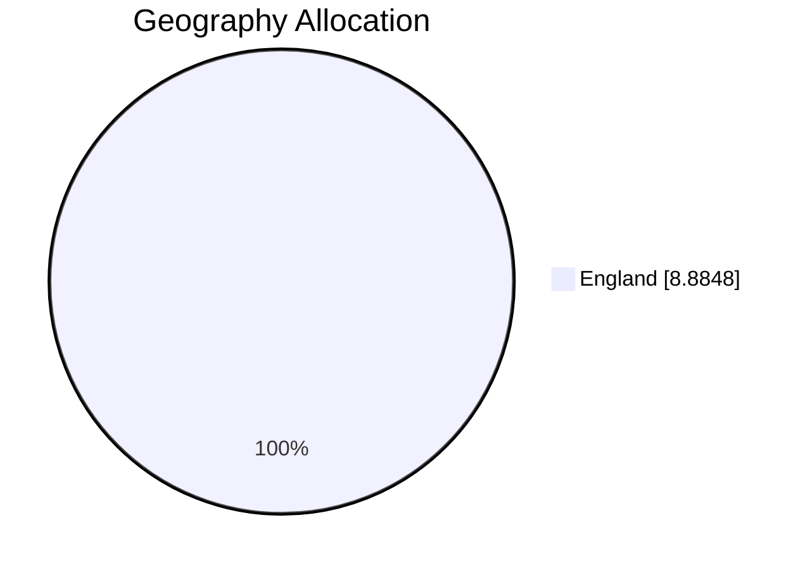
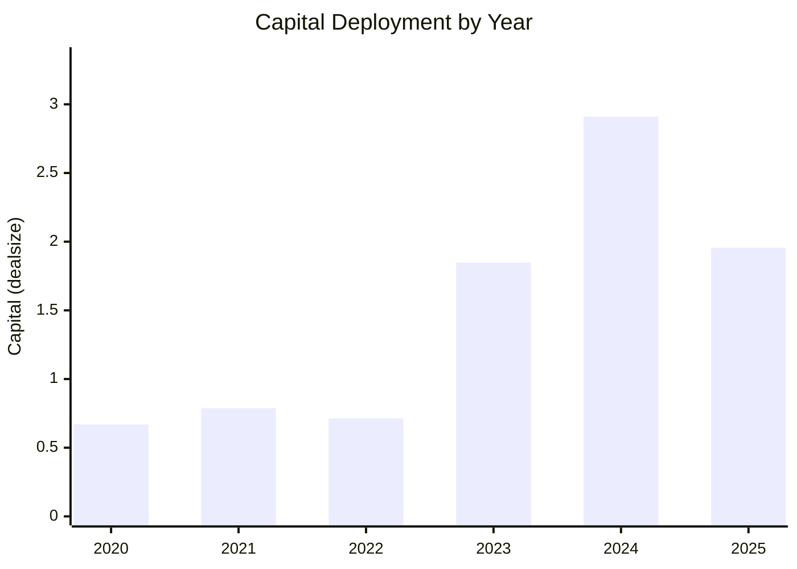

# MEIF Relevant Deals Dashboard

> Sources: `MEIF West Midlands Equity Fund_investment.csv` + `Deal_Info_20260426.csv` | Filtered by investor names: Future Planet Capital / Midven / Midlands Engine Investment Fund (+ MEIF variations)

> Relevant filtered deals: **12** (matched using columns: dealsynopsis, investors, newinvestors, followoninvestors)

## 1) Executive Fund Snapshot

| Metric | Value |
|---|---|
| Total relevant deals | 12 |
| Total invested capital | 8.88 |
| Number of portfolio companies | 8 |
| Average deal size | 0.99 |
| Median deal size | 0.71 |
| Largest investment | IDenteq (1.95) |
| Most recent investment | CyberQ Group (2026-03-01) |

Focus: only deal activity tied to target investors/funds for day-to-day monitoring.

## 2) Capital Allocation Breakdown

### Top Companies by Invested Amount
| Company | Capital | Share of Total |
|---|---|---|
| iEthico | 2.36 | 26.6% |
| IDenteq | 1.95 | 22.0% |
| Medmin | 1.85 | 20.8% |
| CyberQ Group | 1.26 | 14.2% |
| Birtelli's | 0.68 | 7.7% |

### Allocation by Sector
| Sector | # Investments | Capital | Share |
|---|---|---|---|
| Healthcare | 3 | 4.21 | 47.4% |
| Information Technology | 3 | 3.69 | 41.5% |
| Consumer Products and Services (B2C) | 1 | 0.68 | 7.7% |
| Energy | 2 | 0.30 | 3.4% |

Shows where exposure is concentrated by industry theme.

### Allocation by Stage
| Stage | # Investments | Capital | Share |
|---|---|---|---|
| Venture Capital | 9 | 8.88 | 100.0% |

Checks whether deployment stays aligned with stage mandate.

### Allocation by Geography
| Region | # Investments | Capital | Share |
|---|---|---|---|
| England | 9 | 8.88 | 100.0% |

Highlights location concentration and sourcing breadth.

### Allocation by Year
| Year | # Deals | Capital |
|---|---|---|
| 2020 | 2 | 0.67 |
| 2021 | 2 | 0.79 |
| 2022 | 1 | 0.71 |
| 2023 | 1 | 1.85 |
| 2024 | 2 | 2.91 |
| 2025 | 1 | 1.95 |

Tracks deployment pace and vintage clustering.

### Top Co-Investors (in filtered deals)
| Co-investor | # Deals |
|---|---|
| Uk Innovation & Science Seed Fund | 3 |

## 3) Concentration and Risk Checks

| Check | Result |
|---|---|
| Top 5 companies as % of total capital | 91.3% |
| Largest sector exposure | Healthcare (47.4%) |
| Largest geography exposure | England (100.0%) |
| Unusually large deals (IQR rule) | None flagged / insufficient data |

## 4) Practical Management Insights

- Capital concentration is high: top 5 companies represent **91.3%** of tracked capital.
- Geographic exposure is concentrated in **England** (100.0%).
- Some filtered deals have missing deal size; this reduces capital-based comparability.
- Deployment is concentrated by vintage; peak year is **2024**.

### Suggested Daily Follow-Ups
- Compare every new deal against median ticket size before IC sign-off.
- Maintain watchlist of top holdings and expected follow-on capital needs.
- Update missing data fields weekly to keep dashboard decision-ready.

## 5) Data Quality and Coverage

| Field | Missing | Status |
|---|---|---|
| Deal size | 3/12 (25.0%) | Partial |
| Deal date | 0/12 (0.0%) | OK |
| Sector | 0/12 (0.0%) | OK |
| Stage | 0/12 (0.0%) | OK |
| Geography | 0/12 (0.0%) | OK |
| Deal ID | 0/12 (0.0%) | OK |

## 6) Data Cleaning Process

- **Column normalization:** standardized both CSV headers to lowercase `snake_case` to prevent casing/spacing mismatches.
- **Text normalization:** normalized company names and investor text for case-insensitive matching and fallback joins.
- **Investor/fund filtering:** scanned investor-related text fields and `dealsynopsis` using keyword patterns (`Future Planet Capital`, `Midven`, `Midlands Engine Investment Fund`, `MEIF`, `Midlands Engine`).
- **Type coercion:** converted deal amount columns to numeric and date columns to datetime with safe coercion (`errors="coerce"`).
- **Join logic:** merged filtered deal-level rows to company-level attributes using `companyid` first, then normalized `companyname` fallback.
- **Missing-value handling:** excluded null amounts from capital-based metrics; tracked missingness for key fields in the data-quality table.
- **Metric safeguards:** skipped unavailable metrics gracefully and marked them in the README instead of failing generation.

- Filtering logic uses case-insensitive pattern matching over investor/fund-related text fields.
- Join logic prefers `companyid`; if unavailable, falls back to normalized company name.
- Metrics requiring unavailable columns are skipped and documented above.

## Rebuild

Run `python generate_dashboard.py` for full dashboard, or `python generate_dashboard.py --brief` for one-page mode.
