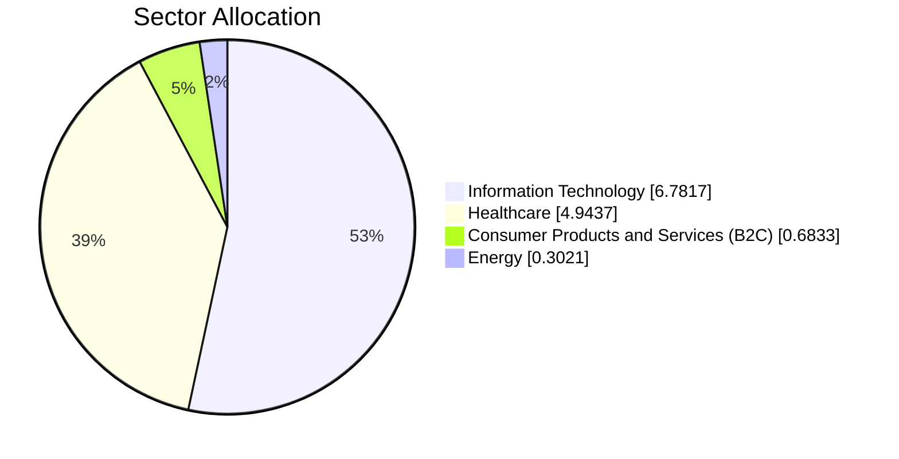
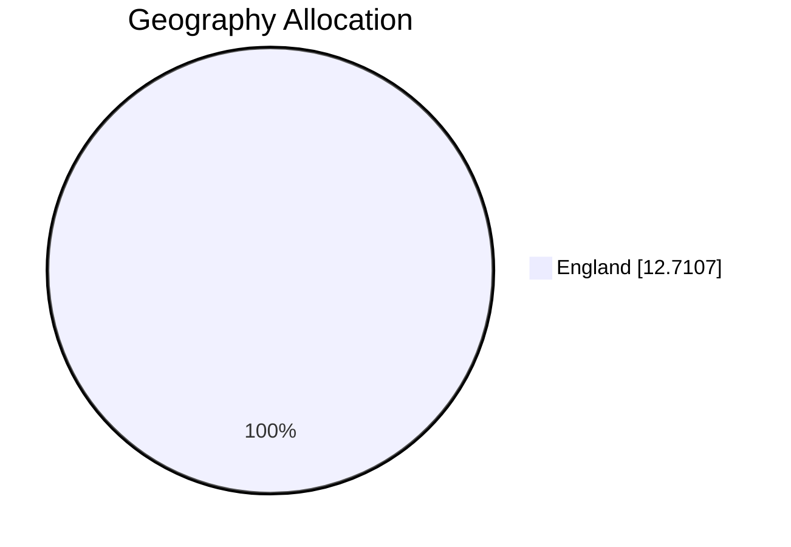
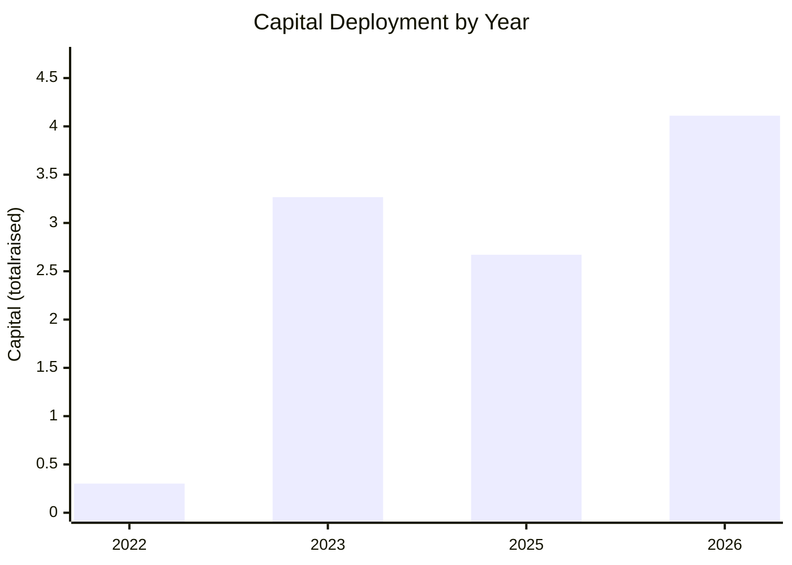

# MEIF West Midlands Equity Fund - Daily Management Dashboard

> Source: `MEIF West Midlands Equity Fund_investment.csv` | Records: **8** | Capital coverage: **7/8 (87.5%)** using `totalraised`

## 1) Executive Fund Snapshot

| Metric | Value |
|---|---|
| Total invested capital | 12.71 |
| Number of investments | 8 |
| Number of portfolio companies | 8 |
| Average investment size | 1.82 |
| Median investment size | 1.95 |
| Largest investment | CyberQ Group (4.11) |
| Most recent investment | CyberQ Group (2026-03-16) |

Focus: compact view for daily portfolio monitoring and exception tracking.

## 2) Capital Allocation Breakdown

### Top Companies by Invested Amount
| Company | Capital | Share of Total |
|---|---|---|
| CyberQ Group | 4.11 | 32.3% |
| Medmin | 2.58 | 20.3% |
| iEthico | 2.36 | 18.6% |

### Allocation by Sector
| Sector | # Investments | Capital | Share |
|---|---|---|---|
| Information Technology | 3 | 6.78 | 53.4% |
| Healthcare | 2 | 4.94 | 38.9% |
| Consumer Products and Services (B2C) | 1 | 0.68 | 5.4% |
| Energy | 1 | 0.30 | 2.4% |

Shows where exposure is concentrated by industry theme.

### Allocation by Geography
| Region | # Investments | Capital | Share |
|---|---|---|---|
| England | 7 | 12.71 | 100.0% |

Highlights location concentration and sourcing breadth.

### Allocation by Year
| Year | # Investments | Capital |
|---|---|---|
| 2022 | 1 | 0.30 |
| 2023 | 2 | 3.27 |
| 2025 | 2 | 2.67 |
| 2026 | 1 | 4.11 |

Tracks deployment pace and vintage clustering.

## 3) Concentration and Risk Checks

| Check | Result |
|---|---|
| Top 5 investments as % of total capital | 92.2% |
| Largest sector exposure | Information Technology (53.4%) |
| Largest geography exposure | England (100.0%) |
| Missing investment amount rows | 1 |
| Unusually large deals (IQR rule) | None flagged |

## 4) Practical Management Insights

- Concentration is high: top 5 holdings represent **92.2%** of invested capital; prioritize diversification in upcoming deployments.
- Sector exposure is skewed to **Information Technology** at **53.4%**; review target sector limits.
- Geographic exposure is concentrated in **England** (100.0%); expand regional pipeline where mandate allows.
- Data quality: some rows have missing investment amounts; close gaps before monthly reporting.
- Deployment pace is uneven; peak year is **2026**. Track whether new deals smooth vintage risk.

### Suggested Daily Follow-Ups
- Compare each new deal against median ticket size before IC sign-off.
- Keep top holdings and missing data fields on a weekly exception list.

## Rebuild

Run `python generate_dashboard.py` for full dashboard, or `python generate_dashboard.py --brief` for one-page mode.
